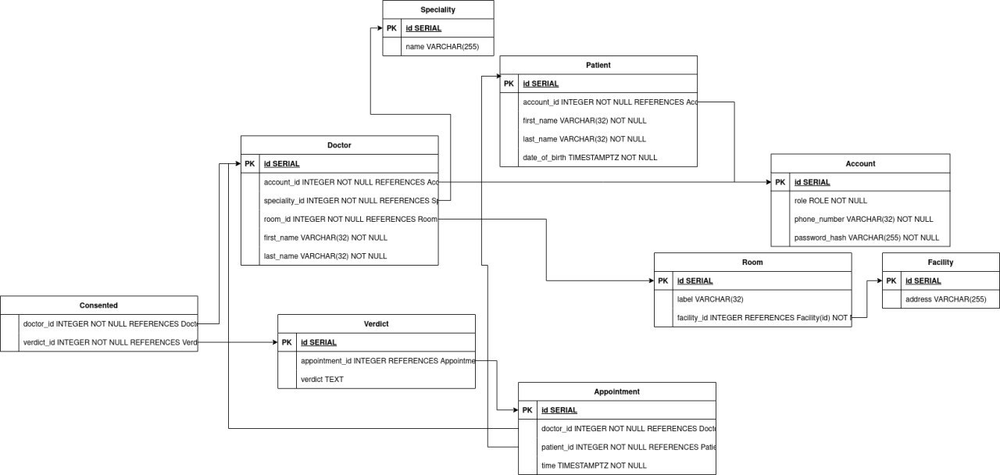
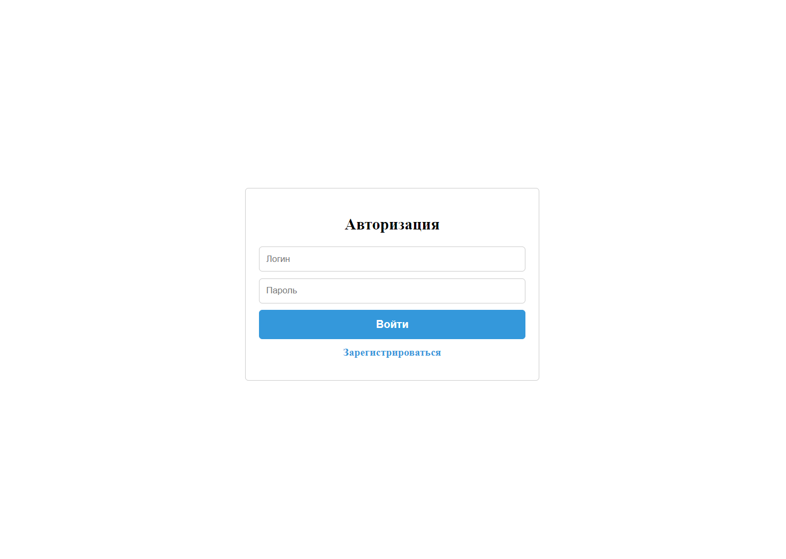
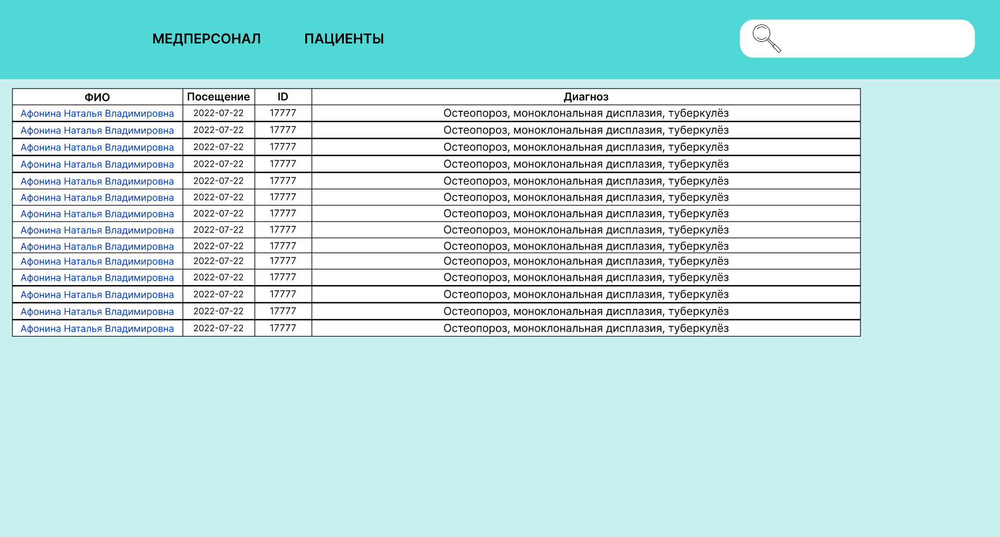

# Поликлиника

Поликлиника - это программная система, предназначенная для врачей и работников регистратуры поликлиники.

# Содержание
*В процессе разработки*

# Роли в команде
* Тимлид [Кириченко Н.Д.](https://github.com/KirichenkoND)
* Frontend-Разработчик [Ганьшин Д.А.](https://github.com/Cooper-Farnsworth)
* Backend-Разработчик [Шустров В.Р.](https://github.com/ItsEthra)
* Тестировщик [Мигель Д.Г.](https://github.com/DooMiaN)
* Системный аналитик [Сафиуллин Т.И.](https://github.com/SafiullinT)

# Стек технологий
В этом проекте используется следующий стек технологий:
* СУБД PostgreSQL
* React + TS + Vite
* Rust
* Figma

# База данных
В данной программной системе используется СУБД PostgreSQL.
Структура базы данных выглядит следующим образом:



# API и SWAGGER
*В процессе разработки*

# Макет веб-приложения
Макет веб-приложения расположен по следующей ссылке [*макет*](https://www.figma.com/file/0ZRSijy5h8b0xTVLDtl7Pj/%D0%9F%D0%BE%D0%BB%D0%B8%D0%BA%D0%BB%D0%B8%D0%BD%D0%B8%D0%BA%D0%B0?type=design&node-id=0-1&mode=design&t=rnU5u2QP7wvDrIpP-0)

## Описание макетов приложения

1. Авторизация


1. Список пациентов


1. Список врачей


1. Медкарта пациента


# Сбор контейнера backend
```
cd backend
docker build -t hospital-backend .
docker run --name hospital-backend -e DATABASE_URL=<postgres_url> -d -p 9000:9000 hospital-backend
```
